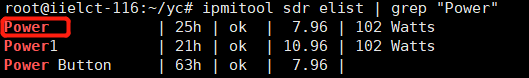
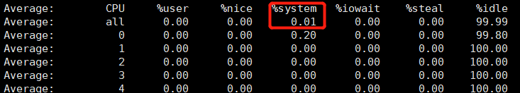
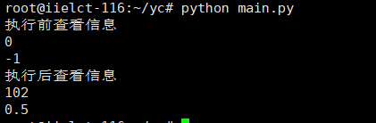
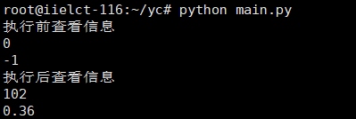
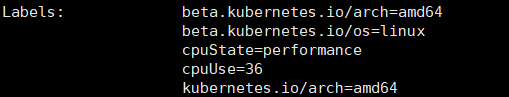
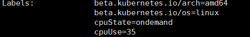
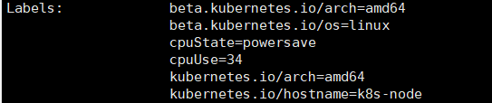
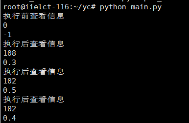
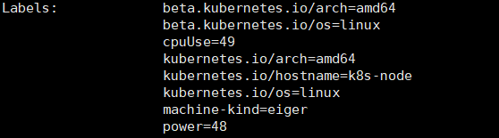

1、read_server_power方法获取服务器功耗，匹配ipmi的运行结果，从中找到Power加两个空格，解析出后面的功耗数值，**不同的机器有不同的方法，可能需要修改**   
  

2、read_server_usage采用psutil包来获取cpu使用率，read_server_usage_old通过解析sar -P ALL -u 1 5命令，来获取cpu利用率的平均值，两种方法都可以成功查看。  

 

 

  

3、我们获取cpu目前所处的状态，并记录到label中。

  

  

  

4、我们写了一个死循环来循环获取数值，然后修改节点标签的值，配置文件中node_name为节点的名称。
  

  

  