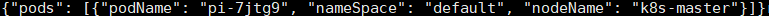

# 一 运行采集程序
采集脚本采集服务器功率、cpu频率等信息，并进行存储。  
运行方式： nohup python ./base_code/set_power_and_cpu_usage.py &

# 二 开关机
## 调度 ##

1. 命令格式  
python ./open_close_code/dispatch/open_machine.py  
python ./open_close_code/dispatch/close_machine.py  
2. 命令解释  
以上两个python脚本分别对应开关机的能效优化  
开机逻辑：遍历所有的pod，当pod调度失败的原因是因为资源不足时，我们开启节点，给出要开启节点的名称。  
关机逻辑：遍历所有的节点，当节点上没有pod运行时，关闭节点，给出要关闭节点的名称。  
3. 返回结果格式   

```
{
  “powerOn”:[
  	"node14","node15"
  ]
}
```


```
{
  “powerOff”:[
  	"node14","node15"
  ]
}
```

4. 示例  
将结果写到了指定文件，关机的写到了/workspace/schedule/power/mac_close.json；开机的写到了/workspace/schedule/power/mac_open.json      
  

  

## 迁移 ##

1. 命令格式  
python ./open_close_code/migrate/migrate.py  
2. 命令解释  
以上python脚本对应开关机的能效优化 :寻找集群中运行pod个数最少的num个节点（配置文件中定义），将这num个节点上运行的pod迁移到其他机器上，并将这些机器关闭。返回结果：需要迁移的pod和目标节点以及需要关闭的节点。  
3. 返回结果格式  

```
{
  "pods": [
  	{
		"podName":"namexx1",
		"nameSpace":"default",
		"nodeName":"node14"
  	},
  	{},
  	{
		"podName":"namexx2",
		"nameSpace":"default",
		"nodeName":"node15"
  	}
  ],
  “powerOff”:[
  	"node12","node13"
  ]
}
```
4. 示例  
将结果写到了指定文件，/root/workspace/schedule/power/close_machine_migrate.json
   


# 三 DVFS（基于使用率频率的优化）
## 调度 ##

1. 命令格式  
python ./dvfs_code/dispatch/adjust_freq.py  
python ./dvfs_code/dispatch/set_freq.py  
sudo ./dvfs_code/dispatch/dvfsScheduler/dvfsScheduler 提前编译好基于extender的调度程序dvfsScheduler，配置k8s调度器，配置完成后，在调度时即可调用dvfsScheduler程序
2. 命令解释  
第一二条命令（两个独立程序，一个负责监控一个负责调节）：实时监控CPU利用率，当某个机器的利用率低于某个数值时，通过dvfs把该机的cpu频率降低。当CPU利用率上升时，再通过dvfs恢复cpu频率。  
第三条命令：完成extender的运行，k8s在筛选节点时，只在没有其它可用节点的情况下，才考虑将pod调度在以最低频率运行的机器，如果选中了某台低频率机器，先把它的频率恢复正常。  
3. 返回结果格式  
无需开关节点，无需进行迁移，由k8s调度器以及extender共同完成调度，我们的python脚本完成频率调节。
4. 执行结果  
   
   
   

## 迁移 ##

1. 命令格式  
python ./dvfs_code/migrate/dvfs_migrate.py  
2. 命令解释  
设置几台空闲节点，实时监控CPU利用率，当某个机器的利用率高于某个数值时，把该节点上的pod迁移到利用率低的节点上，直到低于某个阈值。  
3. 返回结果格式  

```
{
  "pods": [
  	{
		"podName":"namexx1",
		"nameSpace":"default",
		"nodeName":"node14"
  	},
  	{},
  	{
		"podName":"namexx2",
		"nameSpace":"default",
		"nodeName":"node15"
  	}
  ]
}
```

4. 执行结果  
   
  

# 四 power capping（基于功率的优化）
## 调度 ##

1. 命令格式  
python ./power_capping_code/dispatch/adjust_power.py  
python ./power_capping_code/dispatch/set_capping.py  
sudo ./power_capping_code/dispatch/powerCappingScheduler/powerCappingScheduler 提前编译好基于extender的调度程序powerCappingScheduler，配置k8s调度器，配置完成后，在调度时即可调用powerCappingScheduler程序
2. 命令解释  
第一、二条命令（两个独立程序，一个负责监控一个负责调节）：实时监控服务器功率，当某个机器的功率高于最大功率的一个百分比时，通过power capping限制该机的功率。    
第三条命令：完成extender的运行，k8s在筛选节点时，只在没有其它可用节点的情况下，才考虑将pod调度在被限制功率的机器上，如果选中了某台被限制功率的机器，先解除功率限制。  
3. 返回结果格式  
无需开关节点，无需进行迁移，由k8s调度器以及extender共同完成调度，我们的python脚本完成功率限制/取消功率限制。
4. 执行结果  
   
   
   

## 迁移 ##

1. 命令格式  
python ./power_capping_code/migrate/capping_migrate.py  
2. 命令解释  
实时监控服务器功率，当某个机器的功率高于最大功率的一个百分比时，首先选择num个pod，执行迁移；迁移完成后仍无法降低功率则直接进行功率限制。  
3. 返回结果格式  

```
{
  "pods": [
  	{
		"podName":"namexx1",
		"nameSpace":"default",
		"nodeName":"node14"
  	},
  	{},
  	{
		"podName":"namexx2",
		"nameSpace":"default",
		"nodeName":"node15"
  	}
  ]
}
```

4. 执行结果  
   
   


# 五 scheduler extender配置及运行

## 配置 ##
创建sched.yaml文件，保存scheduler extender的配置    
    
修改k8s调度器配置文件，一般在目录/etc/kubernetes/manifests下面  
    
    
   
## 运行 ##
go build -o main *.go   
./main