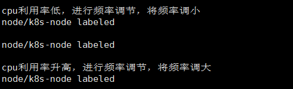
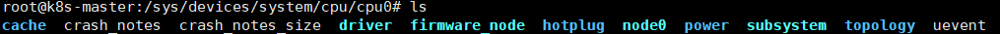
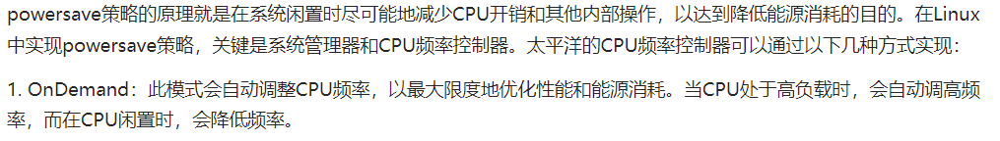
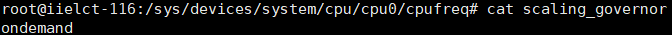
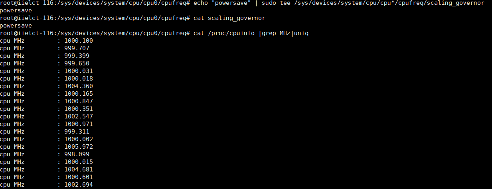
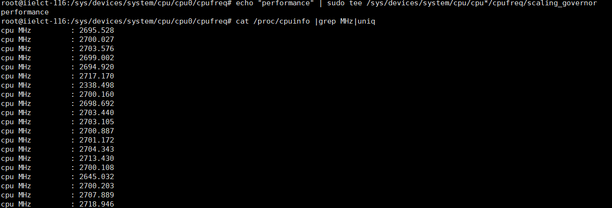
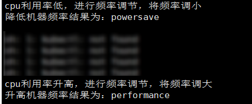

1、我们的初步想法是设计一个程序运行在master节点上，遍历集群的每台机器，如果机器的利用率高于或者低于阈值，进行cpu频率的调节。  

目前的阈值设置的是20%，可以看到能进行正确的处理。

  

2、阿里云机器上没有进行cpu调节的权限  

 

 

3、只能在实验室机器上进行调频实验.默认是Ondemand
 

 

4、可以进行两种模式的调节，分别是powersave和performance  
 

 

5、写的接口可以进行频率的调节  
 