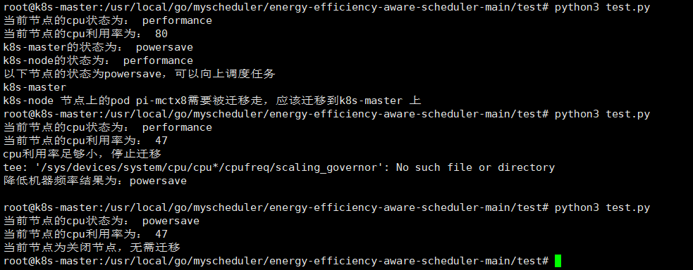

1、目前情况下我们假设有多台机器，其中一部分节点没有运行pod，将其cpu状态设置为powersave模式。  

2、现在仍有一些节点运行着任务，它处于perfermance模式，cpu利用率较高，我们将上面的pod进行迁移，随即迁移pod，迁移完之后检查cpu利用率，看看高低。  

  

3、cpu利用率降低到一定阈值了，我们调整其cpu状态  

4、后面调整完状态后已经不用在进行迁移，结束  