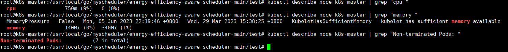
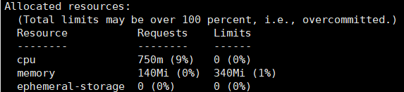
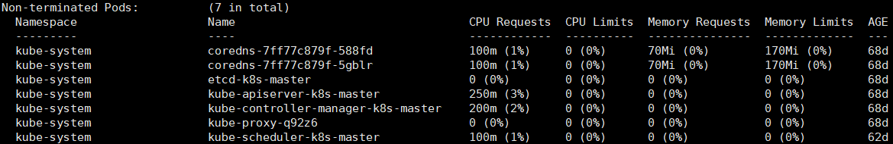
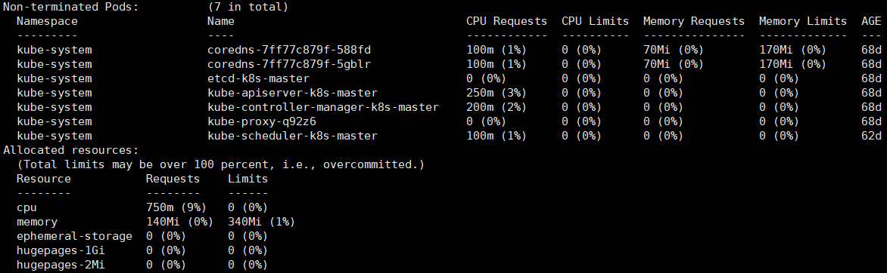
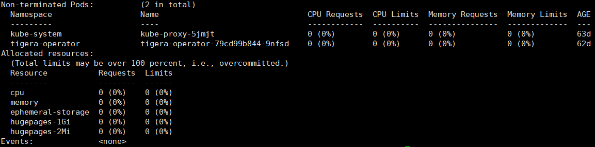
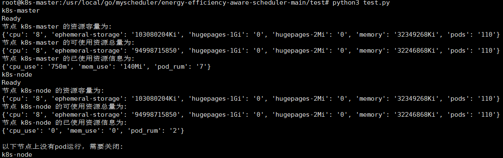
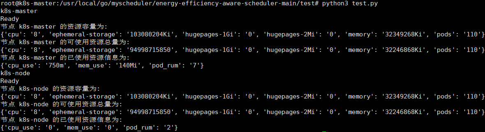

1、get_node_capacity方法获取节点的资源容量，使用命令kubectl get nodes {node_name} -o json即可获得，存放在["status"]["capacity"]。     
2、get_node_allocatable_resource方法获取某个节点可以分配的资源总量，使用命令kubectl get nodes {node_name} -o json即可获得，存放在["status"]["allocatable"]。  
3、get_used_resources方法获取某个节点已经分配的资源以及节点上运行的pod的个数，通过对describe命令进行解析获得。

 

  

  

 

4、如果某个节点上已经分配的资源总量为0，那么该节点上没有pod运行，我们关闭这台机器。  
注：实验证明了不能够单纯的用pod个数来决定有没有pod运行，可能会有一些系统级别的pod在运行，但是他们一般不会分配资源，因此可以用是否有资源被分配决定是否要关闭。
  

 

 

5、最终能够获取到的信息如下所示   
  
