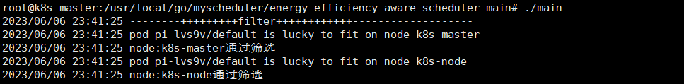
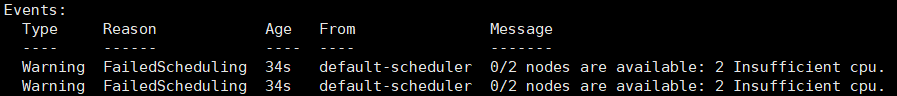
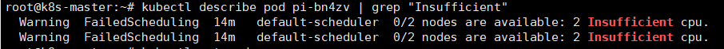
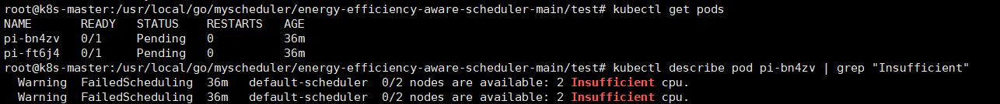
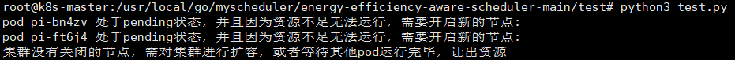
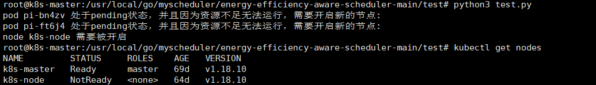
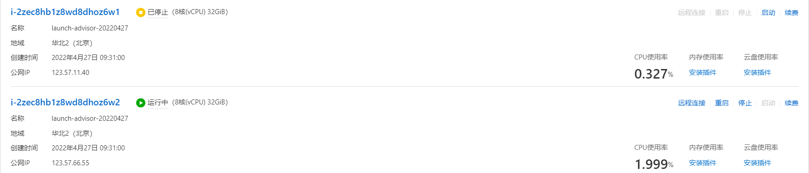

1、本来想的是我们开发一个scheduler extender调度程序，在scheduler extender调度程序的预选阶段，通过传递过来的节点信息来判断是否需要开启，我们进行了实验，发现是先经过k8s调度器的预选阶段，然后才会调用scheduler extender，没有节点通过k8s原生调度器的话，就不会调用scheduler extender，因此这个想法无法实现。  

  

 

2、我们新的想法是遍历pod，如果有pod处于pending状态，我们查看处于pending状态的原因，如果是因为资源不足，我们就会开启新的节点。  

  

 

 

3、当资源不足，并且节点都处于开启状态，则没有节点可以打开。如果有节点处于NotReady状态，则可以开启。  
 

 

 