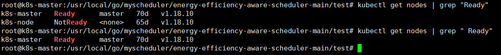
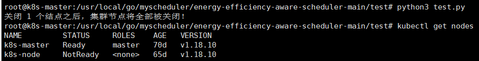
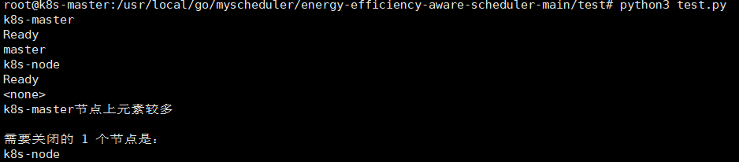
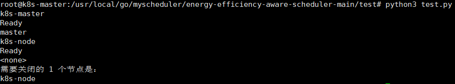
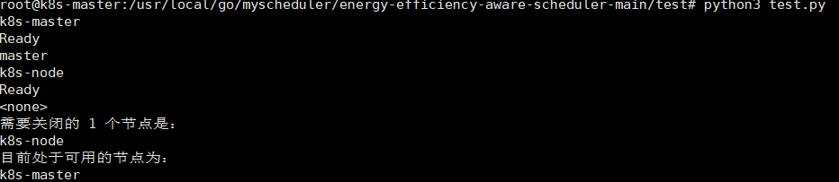
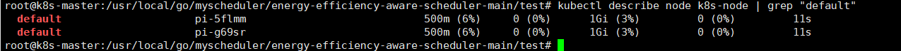
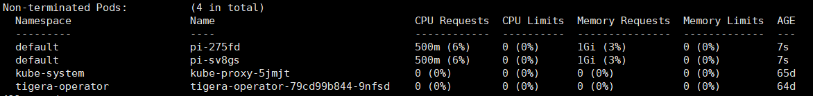
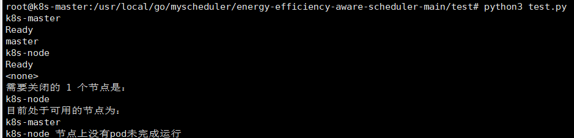
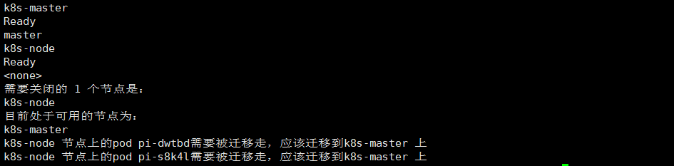

1、我们的想法是获取每一个状态为Ready节点上的pod个数（不处于succeed状态，已经运行完成），pod个数最少的num个节点需要关闭，master节点（role为master不能关闭）。

 

 

 

 

 

找到需要关闭的节点，我们通过解析命令，来获取需要迁移走的pod，一些系统pod的命名空间不属于default，因此实际实验请在default下运行，可以排除一些系统pod的迁移。

迁移这里我是按照轮询的代码逻辑写的，但是因为我们的集群只有两个节点，我没有办法测试，目前看起来没问题.  

 

 

 

 