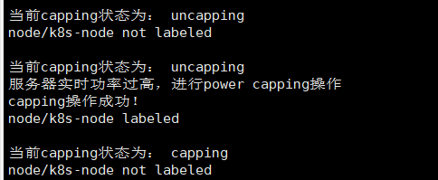
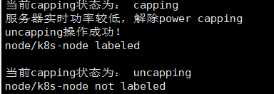

1、我们实时获取服务器的功率，当服务器功率大于某个阈值，且服务器的capping状态为uncapping时，我们在服务器上进行capping  

可以看到能进行正确的处理。

  

2、当服务器功率小于某个阈值，且服务器的capping状态为capping时，我们在服务器上进行uncapping  

可以看到能进行正确的处理。  

 

3、我们的机器上不支持power capping接口，但是我们的接口在以前的时候测试过，没有问题